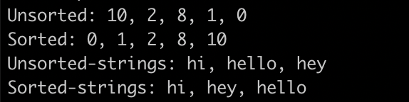

# Advanced Building Blocks - Bubble Sort

> First project of Ruby Module.

In this project, we implemented the bubble sort algorithm. Assignment is focused on the use of yield and passing a block to a method..

## Built With

- Ruby

## Getting Started

**This is an example of how you may give instructions on setting up your project locally.**
**Modify this file to match your project, remove sections that don't apply. For example: delete the testing section if the currect project doesn't require testing.**

To get a local copy up and running follow these simple example steps.

### Prerequisites

### Setup

### Install

### Usage

### Run tests

### Deployment

## Authors

👤 **Author1**

- GitHub: [@githubhandle](https://github.com/githubhandle)
- Twitter: [@twitterhandle](https://twitter.com/twitterhandle)
- LinkedIn: [LinkedIn](https://linkedin.com/linkedinhandle)

👤 **Elmer Lopez**

- GitHub: [@memelopez](https://github.com/memelopez/)
- Twitter: [@memelopez10](https://twitter.com/memelopez10)
- LinkedIn: [Elmer Lopez](https://www.linkedin.com/in/elmer-lopez-51b187200/)

## 🤝 Contributing

Contributions, issues, and feature requests are welcome!

Feel free to check the [issues page](issues/).

## Show your support

Give a ⭐️ if you like this project!

## Acknowledgments

- Hat tip to anyone whose code was used
- Inspiration
- etc

## 📝 License

This project is [MIT](https://opensource.org/licenses/MIT) licensed.